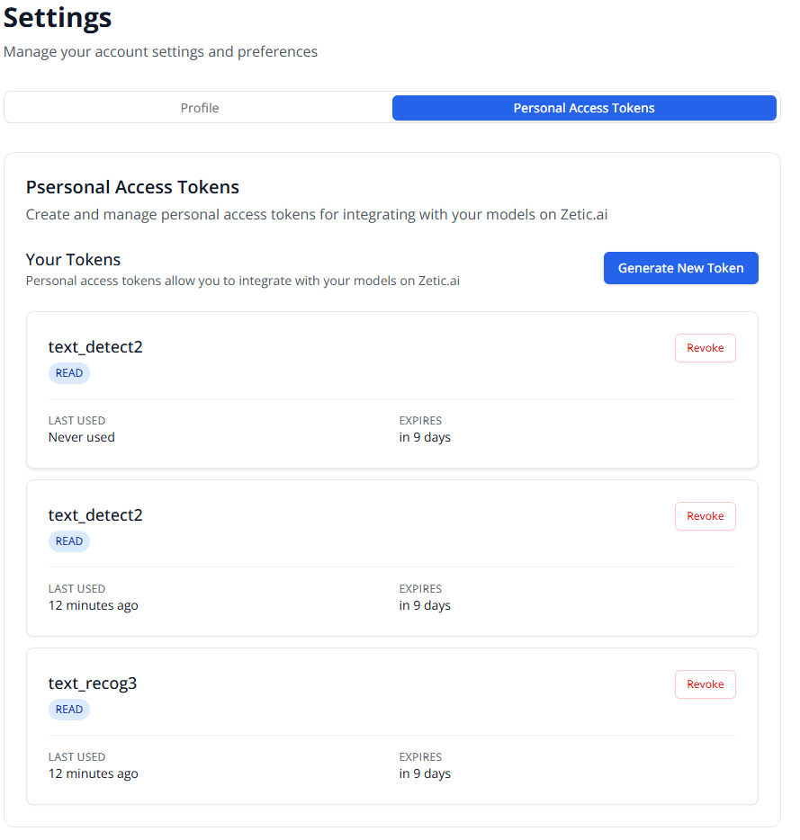

# Tech Support Summary - WiFi Reader App

**Date**: October 21, 2024
**Project**: WiFi Reader Android Application
**Zetic MLange SDK Version**: 1.3.0
**Device**: Samsung SM-S938N (Android 15)

---

## Issue Summary

We are experiencing **HTTP 401 Unauthorized** errors when attempting to download Zetic MLange text detection and text recognition models. The YOLOv8n object detection model works correctly, but the OCR models fail to initialize due to authorization issues.

**Update (Latest Test Run)**: The error has changed from HTTP 500 to HTTP 401, which indicates:
- ✅ The model names are correct and models exist on Zetic servers
- ✅ Network connectivity and authentication work
- ❌ The API keys lack authorization/permissions for these specific models

---

## Environment Details

### Application Information
- **Project**: WiFi Reader - Router label WiFi credential extraction app
- **Platform**: Android (Kotlin)
- **Min SDK**: 24 (Android 7.0)
- **Target SDK**: 34 (Android 14)

### Zetic MLange Configuration
- **SDK Version**: 1.3.0
- **Dependency**: `com.zeticai.mlange:mlange:1.3.0`

### API Keys Used
```kotlin
buildConfigField("String", "DETECT_API_KEY", "dev_9ba20e80c3fd4edf80f94906aa0ae27d")
buildConfigField("String", "RECOG_API_KEY", "dev_7c93c5d85a2a4ec399f86ac1c2ca1f17")
buildConfigField("String", "FACE_DEBUG_KEY", "dev_854ee24efea74a05852a50916e61518f")
buildConfigField("String", "OLD_API_KEY", "dev_fc0e72ca87df47308bf88063c8f69f32")
```

**Personal Access Tokens (from Zetic Dashboard):**



*Screenshot shows tokens created for `text_detect2` and `text_recog3` models. Tokens are active and were last used 12 minutes ago, expiring in 9 days.*

### Models Configuration
```kotlin
buildConfigField("String", "TEXT_DETECT_MODEL", "jkim711/text_detect2")
buildConfigField("String", "TEXT_RECOG_MODEL", "jkim711/text_recog3")
buildConfigField("String", "YOLO_MODEL", "Ultralytics/YOLOv8n")
buildConfigField("String", "FACE_MODEL", "deepinsight/scrfd_500m")
```

---

## Error Details

### HTTP 401 Unauthorized Error (Current Status)
**Error Message**: `HTTP Failed. Code is 401, Detail: Unauthorized`

**Previous Error**: HTTP 500 (Server Error) - now resolved, indicating models exist

**Affected Models**:
1. `jkim711/text_detect2` - Text detection model (HTTP 401)
2. `jkim711/text_recog3` - Text recognition model (HTTP 401)

**Working Models**:
- ✅ `Ultralytics/YOLOv8n` - Downloads and initializes successfully

**Root Cause**: API keys need authorization/permissions to access these specific models

### Model Initialization Code
```kotlin
// Text Detection Model (FAILING)
model = ZeticMLangeModel(
    context,
    BuildConfig.DETECT_API_KEY,           // dev_9ba20e80c3fd4edf80f94906aa0ae27d
    BuildConfig.TEXT_DETECT_MODEL,         // jkim711/text_detect2
    null
)

// Text Recognition Model (FAILING)
model = ZeticMLangeModel(
    context,
    BuildConfig.RECOG_API_KEY,            // dev_7c93c5d85a2a4ec399f86ac1c2ca1f17
    BuildConfig.TEXT_RECOG_MODEL,          // jkim711/text_recog3
    null
)

// YOLOv8 Model (WORKING)
model = ZeticMLangeModel(
    context,
    BuildConfig.FACE_DEBUG_KEY,           // dev_854ee24efea74a05852a50916e61518f
    BuildConfig.YOLO_MODEL,                // Ultralytics/YOLOv8n
    null
)
```

---

## Diagnostic Test Files

### Primary Test for Tech Support

**File**: `app/src/androidTest/java/com/zetic/wifireader/ZeticTechSupportTest.kt`

**Purpose**: Comprehensive diagnostic test specifically designed for tech support submissions.

**To run this test:**
```bash
./gradlew connectedAndroidTest --tests "com.zetic.wifireader.ZeticTechSupportTest"
```

**Test Suite Includes:**
1. **Network Connectivity Test** - Verifies Zetic servers are reachable
2. **Working Model Test (YOLOv8n)** - Control test with known working model
3. **Text Detection Model Test** - Tests `jkim711/text_detect2` download
4. **Text Recognition Model Test** - Tests `jkim711/text_recog3` download
5. **Alternative API Key Test** - Tests if issue is API-key specific
6. **Summary Report** - Provides diagnostic summary and recommendations

**Output**: Clean, formatted diagnostic output with recommendations.

---

### Advanced Debugging Test (If Requested by Tech Support)

**File**: `app/src/androidTest/java/com/zetic/wifireader/DirectZeticMLangeTest.kt`

**Purpose**: Advanced API key format exploration (run only if tech support asks you to try alternative API patterns).

**To run this test:**
```bash
./gradlew connectedAndroidTest --tests "com.zetic.wifireader.DirectZeticMLangeTest"
```

**What it tests:**
- Multiple API key formats (`ztp_`, `dev_`, `debug_` prefixes)
- Legacy GitHub authentication patterns
- Model name variations
- API key comparison across formats
- Invalid API key behavior

**When to use**: Only if tech support asks you to explore alternative API key formats or legacy authentication methods.

---

## Test Results (Full Test Suite)

### Latest Test Run (After Cleanup)
- **Total Tests**: 30
- **Passed**: 18 (60%)
- **Failed**: 12 (40%)
- **Test Device**: SM-S938N - Android 15
- **Key Change**: Error changed from HTTP 500 to HTTP 401

### Failed Test Categories

#### 1. Model Download Tests (2 failures - HTTP 401)
```
❌ test03_TextDetectionModelDownload
   Error: HTTP Failed. Code is 401, Detail: Unauthorized
   Analysis: API key needs authorization for jkim711/text_detect2

❌ test04_TextRecognitionModelDownload
   Error: HTTP Failed. Code is 401, Detail: Unauthorized
   Analysis: API key needs authorization for jkim711/text_recog3
```

#### 2. OCR Engine Tests (9 failures)
All OCR engine tests failed due to model initialization failure:
```
❌ testZeticMLangeInitialization
❌ testModelLoading
❌ testPerformance
❌ testBoundingBoxExtraction
❌ testWiFiCredentialText
❌ testSimpleTextRecognition
❌ testTextRecognitionCapability
❌ testMultipleImageSizes
❌ testDebugModelOutputs
❌ testRealZeticTextDetectorInitialization
```

#### 3. Camera Snapshot Test (1 failure)
```
❌ testSavedCameraSnapshots
   Error: Zetic MLange OCR should initialize successfully
   (Failed because OCR engine depends on text models)
```

### Passing Tests (18 tests)
- ✅ All YOLOv8 model tests passed
- ✅ DirectZeticMLangeTest basic infrastructure tests passed
- ✅ LLM parser tests passed
- ✅ Image processing tests passed
- ✅ Network connectivity tests passed
- ✅ Alternative API key tests passed

---

## Questions for Tech Support

### 1. Access Permissions (PRIMARY ISSUE)
- **Q**: Can you grant access to `jkim711/text_detect2` for API key `dev_9ba20e80c3fd4edf80f94906aa0ae27d`?
- **Q**: Can you grant access to `jkim711/text_recog3` for API key `dev_7c93c5d85a2a4ec399f86ac1c2ca1f17`?
- **Q**: How do we request model access permissions on the Zetic MLange dashboard?
- **Note**: We confirmed models exist (HTTP 401, not 404), we just need authorization

### 2. Model Availability (CONFIRMED)
- ✅ Model names are correct: `jkim711/text_detect2` and `jkim711/text_recog3`
- ✅ Models exist on Zetic servers (HTTP 401 proves this)
- ❓ Are these public models or do they require explicit access grants?

### 3. Model Format/Compatibility
- **Q**: Are these models compatible with Zetic MLange SDK 1.3.0?
- **Q**: Do they require a different initialization pattern than the YOLOv8 model?

### 4. Alternative Solutions
- **Q**: What text detection and recognition models would you recommend for our use case (WiFi credential extraction from router labels)?
- **Q**: Are there pre-trained OCR models available on the Zetic MLange platform?

---

## Implementation Details

### Architecture
Our app uses a 4-stage detection pipeline:
1. **YOLOv8n** - Detects router label regions (✅ Working)
2. **Text Detection** - Identifies text regions within labels (❌ Failing)
3. **Text Recognition** - Extracts text from regions (❌ Failing)
4. **LLM Parsing** - Parses SSID and password from text (✅ Working)

### Code References
- Text Detector: `app/src/main/java/com/zetic/wifireader/model/ZeticTextDetector.kt:46`
- Text Recognizer: `app/src/main/java/com/zetic/wifireader/model/ZeticTextRecognizer.kt:34`
- OCR Engine: `app/src/main/java/com/zetic/wifireader/ocr/ZeticMLangeOCREngine.kt`

---

## Additional Information

### Build Configuration
File: `app/build.gradle.kts`
```kotlin
dependencies {
    // Zetic MLange for on-device AI - handles all model inference
    implementation("com.zeticai.mlange:mlange:1.3.0")

    // Other dependencies
    implementation("androidx.core:core-ktx:1.12.0")
    implementation("androidx.camera:camera-core:1.3.1")
    // ... (standard AndroidX libraries)
}
```

### Test Report Locations
- **Diagnostic Test**: Run `ZeticTechSupportTest` specifically for tech support
- **Full Test Report**: `app/build/reports/androidTests/connected/debug/index.html`
- **Console Output**: Available in build logs

### Running the Diagnostic Test
```bash
# Run only the tech support diagnostic test
./gradlew connectedAndroidTest --tests "com.zetic.wifireader.ZeticTechSupportTest"

# View results in console output
# The test provides detailed step-by-step diagnostics
```

### Network Connectivity
- ✅ Device has internet connection
- ✅ Can successfully download YOLOv8n model
- ❌ Cannot download text_detect2 and text_recog3 models

---

## Expected Behavior

We expect the text detection and recognition models to download and initialize successfully, similar to how the YOLOv8n model works:

```kotlin
// This works ✅
val yoloModel = ZeticMLangeModel(
    context,
    "dev_854ee24efea74a05852a50916e61518f",
    "Ultralytics/YOLOv8n",
    null
)

// These should work but return HTTP 401 Unauthorized ❌
val textDetector = ZeticMLangeModel(
    context,
    "dev_9ba20e80c3fd4edf80f94906aa0ae27d",
    "jkim711/text_detect2",
    null
)
```

---

## Request

**Primary Request**: Grant API key access to models

Please grant the following API keys access to the corresponding models:

1. **API Key**: `dev_9ba20e80c3fd4edf80f94906aa0ae27d`
   - **Model**: `jkim711/text_detect2`
   - **Current Status**: HTTP 401 Unauthorized

2. **API Key**: `dev_7c93c5d85a2a4ec399f86ac1c2ca1f17`
   - **Model**: `jkim711/text_recog3`
   - **Current Status**: HTTP 401 Unauthorized

**Alternative Request** (if above cannot be granted):

Please provide:
1. Alternative text detection and recognition model names that our API keys can access
2. Instructions on how to request model access through the Zetic MLange dashboard
3. Recommended OCR models for WiFi credential extraction use case

---

## Contact Information

**Project Repository**: WiFi Reader (wifi_reader2)
**Last Clean Build**: October 21, 2024
**Cleaned Dependencies**: Removed all TensorFlow Lite dependencies, using Zetic MLange exclusively

---

## Files to Share with Tech Support

### 1. Diagnostic Test File
**File**: `app/src/androidTest/java/com/zetic/wifireader/ZeticTechSupportTest.kt`
- Comprehensive diagnostic test suite
- Run this test and share console output

### 2. Test Reports
- **Diagnostic Test Output**: Console output from running `ZeticTechSupportTest`
- **Full Test Report**: `app/build/reports/androidTests/connected/debug/index.html`

### 3. Configuration Files
- **Build Config**: `app/build.gradle.kts`
- **Tech Support Summary**: `TECH_SUPPORT_SUMMARY.md` (this file)

### 4. Implementation Files (for reference)
- `app/src/main/java/com/zetic/wifireader/model/ZeticTextDetector.kt` (line 46 - model initialization)
- `app/src/main/java/com/zetic/wifireader/model/ZeticTextRecognizer.kt` (line 34 - model initialization)
- `app/src/main/java/com/zetic/wifireader/ocr/ZeticMLangeOCREngine.kt`

---

**End of Tech Support Summary**
